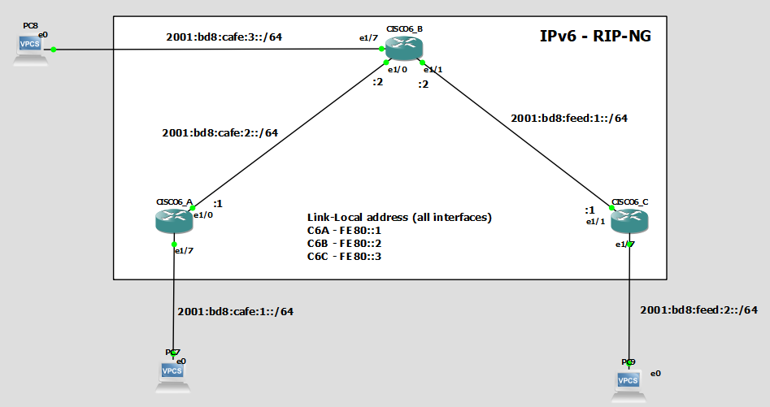

# RIP-NG
## CISCO 7200

### Configuración
Primero, habilitar el uso de ipv6 y configurar las interfaces de cada uno de los routers.
#### CISCO6_A
```
CISCO6_A#conf t
Enter configuration commands, one per line.  End with CNTL/Z.

CISCO6_A(config)#ipv6 unicast-routing
CISCO6_A(config)#interface ethernet 1/0
CISCO6_A(config-if)#ipv6 address fe80::1 link-local
CISCO6_A(config-if)#ipv6 address 2001:db8:cafe:2::1/64
CISCO6_A(config-if)#no shutdown
CISCO6_A(config-if)#exit

CISCO6_A(config)#interface ethernet 1/7
CISCO6_A(config-if)#ipv6 address fe80::1 link-local
CISCO6_A(config-if)#ipv6 address 2001:db8:cafe:1::1/64
CISCO6_A(config-if)#no shutdown
CISCO6_A(config-if)#exit

CISCO6_A(config)#
```
#### CISCO6_B
```
CISCO6_B#conf t
Enter configuration commands, one per line.  End with CNTL/Z.

CISCO6_B(config)#ipv6 unicast-routing

CISCO6_B(config)#interface ethernet 1/0
CISCO6_B(config-if)#ipv6 address fe80::2 link-local
CISCO6_B(config-if)#ipv6 address 2001:db8:cafe:2::2/64
CISCO6_B(config-if)#no shutdown
CISCO6_B(config-if)#exit

CISCO6_B(config)#interface ethernet 1/1
CISCO6_B(config-if)#ipv6 address fe80::2 link-local
CISCO6_B(config-if)#ipv6 address 2001:db8:feed:1::2/64
CISCO6_B(config-if)#no shutdown
CISCO6_B(config-if)#exit

CISCO6_B(config)#interface ethernet 1/7
CISCO6_B(config-if)#ipv6 address fe80::2 link-local
CISCO6_B(config-if)#ipv6 address 2001:db8:cafe:3::1/64
CISCO6_B(config-if)#no shutdown
CISCO6_B(config-if)#exit

CISCO6_B(config)#
```
#### CISCO6_C
```
CISCO6_C#conf t
Enter configuration commands, one per line.  End with CNTL/Z.

CISCO6_C(config)#ipv6 unicast-routing

CISCO6_C(config)#interface ethernet 1/1
CISCO6_C(config-if)#ipv6 address fe80::3 link-local
CISCO6_C(config-if)#ipv6 address 2001:db8:feed:1::1/64
CISCO6_C(config-if)#no shutdown
CISCO6_C(config-if)#exit

CISCO6_C(config)#interface ethernet 1/7
CISCO6_C(config-if)#ipv6 address fe80::3 link-local
CISCO6_C(config-if)#ipv6 address 2001:db8:feed:2::1/64
CISCO6_C(config-if)#no shutdown
CISCO6_C(config-if)#exit

CISCO6_C(config)#
```
Luego, activar el protocolo rip-ng con un nombre de proceso, y activarlo en las interfaces de cada router
#### CISCO6_A
```
CISCO6_A(config)#ipv6 router rip RIP_NG

CISCO6_A(config)#interface ethernet 1/0
CISCO6_A(config-if)#ipv6 rip RIP_NG enable
CISCO6_A(config-if)#exit

CISCO6_A(config)#interface ethernet 1/7
CISCO6_A(config-if)#ipv6 rip RIP_NG enable
CISCO6_A(config-if)#exit
```
#### CISCO6_B
```
CISCO6_B(config)#ipv6 router rip RIP_NG

CISCO6_B(config)#interface ethernet 1/0
CISCO6_B(config-if)#ipv6 rip RIP_NG enable
CISCO6_B(config-if)#exit

CISCO6_B(config)#interface ethernet 1/1
CISCO6_B(config-if)#ipv6 rip RIP_NG enable
CISCO6_B(config-if)#exit

CISCO6_B(config)#interface ethernet 1/7
CISCO6_B(config-if)#ipv6 rip RIP_NG enable
CISCO6_B(config-if)#exit
```
#### CISCO6_C
```
CISCO6_C(config)#ipv6 router rip RIP_NG

CISCO6_C(config)#interface ethernet 1/1
CISCO6_C(config-if)#ipv6 rip RIP_NG enable
CISCO6_C(config-if)#exit

CISCO6_C(config)#interface ethernet 1/7
CISCO6_C(config-if)#ipv6 rip RIP_NG enable
CISCO6_C(config-if)#exit
```
### Configuración de las PC
#### PC7
```
ip 2001:db8:cafe:1::2/64
```
#### PC8
```
ip 2001:db8:cafe:3::2/64
```
#### PC9
```
ip 2001:db8:feed:2::2/64
```