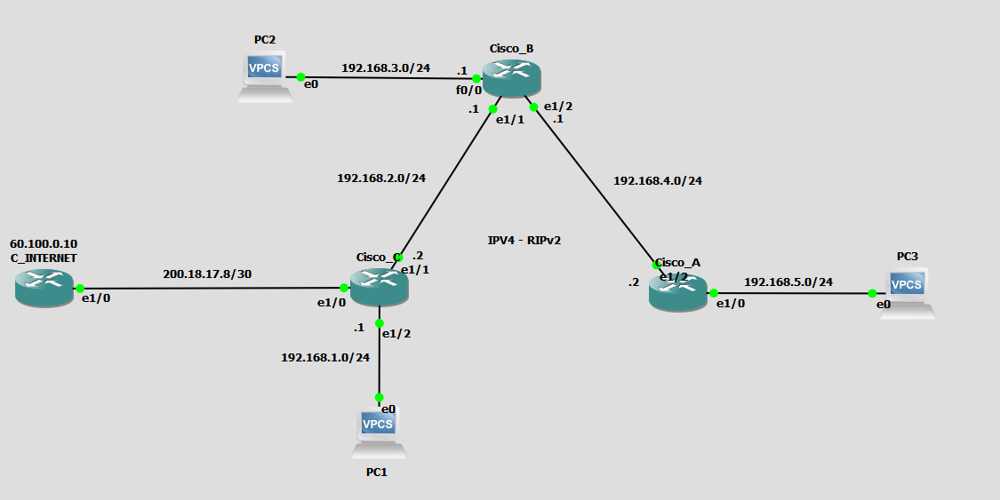

# RIPv2
## Cisco 7200

### Configuración
Primero, configurar las interfaces de cada uno de los routers.  
#### ROUTER CISCO_A
```
Cisco_A#configure terminal

Cisco_A(config)#interface ethernet 1/2
Cisco_A(config-if)#ip address 192.168.4.2 255.255.255.0
Cisco_A(config-if)#no shutdown
Cisco_A(config-if)#exit

Cisco_A(config)#interface ethernet 1/0
Cisco_A(config-if)#ip address 192.168.5.1 255.255.255.0
Cisco_A(config-if)#no shutdown
Cisco_A(config-if)#exit

Cisco_A(config)#interface loopback 0
Cisco_A(config-if)#ip address 1.1.1.1 255.255.255.255
Cisco_A(config-if)#exit
```
#### ROUTER CISCO_B
```
Cisco_B#configure terminal

Cisco_B(config)#interface ethernet 1/2
Cisco_B(config-if)#ip address 192.168.4.1 255.255.255.0
Cisco_B(config-if)#no shutdown
Cisco_B(config-if)#exit

Cisco_B(config)#interface ethernet 1/1
Cisco_B(config-if)#ip address 192.168.2.1 255.255.255.0
Cisco_B(config-if)#no shutdown
Cisco_B(config-if)#exit

Cisco_B(config)#interface fastEthernet 0/0
Cisco_B(config-if)#ip address 192.168.3.1 255.255.255.0
Cisco_B(config-if)#no shutdown
Cisco_B(config-if)#exit

Cisco_B(config)#interface loopback 0
Cisco_B(config-if)#ip address 2.2.2.2 255.255.255.255
Cisco_B(config-if)#exit
```
#### ROUTER CISCO_C
```
Cisco_C#configure terminal

Cisco_C(config)#interface ethernet 1/1
Cisco_C(config-if)#ip address 192.168.2.2 255.255.255.0
Cisco_C(config-if)#no shutdown
Cisco_C(config-if)#exit

Cisco_C(config)#interface ethernet 1/2
Cisco_C(config-if)#ip address 192.168.1.1 255.255.255.0
Cisco_C(config-if)#no shutdown
Cisco_C(config-if)#exit

Cisco_C(config)#interface loopback 0
Cisco_C(config-if)#ip address 3.3.3.3 255.255.255.255
Cisco_C(config-if)#no shutdown
Cisco_C(config-if)#exit
```
Después de configuradas las interfaces, configuramos el protocolo RIPv2 para distribución de rutas.

#### ROUTER CISCO_A
```
Cisco_A(config)#router rip
Cisco_A(config-router)#version 2
Cisco_A(config-router)#network 192.168.5.0
Cisco_A(config-router)#network 192.168.4.0
Cisco_A(config-router)#end
Cisco_A#
```
#### ROUTER CISCO_B
```
Cisco_B(config)#router rip
Cisco_B(config-router)#version 2
Cisco_B(config-router)#network 192.168.2.0
Cisco_B(config-router)#network 192.168.3.0
Cisco_B(config-router)#network 192.168.4.0
Cisco_B(config-router)#end
Cisco_B#
```
#### ROUTER CISCO_C
```
Cisco_C(config)#router rip
Cisco_C(config-router)#version 2
Cisco_C(config-router)#network 192.168.1.0
Cisco_C(config-router)#network 192.168.2.0
Cisco_C(config-router)#end
Cisco_C#
```
Una vez realizada la configuración del protocolo RIPv2, podemos verificar las tablas de routeo ip de cada uno de los routers y ver que se han aprendido mediante RIP las direcciones que anuncian los demas.
#### ROUTER CISCO_A
```
Cisco_A#show ip route
Codes: L - local, C - connected, S - static, R - RIP, M - mobile, B - BGP
       D - EIGRP, EX - EIGRP external, O - OSPF, IA - OSPF inter area
       N1 - OSPF NSSA external type 1, N2 - OSPF NSSA external type 2
       E1 - OSPF external type 1, E2 - OSPF external type 2
       i - IS-IS, su - IS-IS summary, L1 - IS-IS level-1, L2 - IS-IS level-2
       ia - IS-IS inter area, * - candidate default, U - per-user static route
       o - ODR, P - periodic downloaded static route, H - NHRP, l - LISP
       + - replicated route, % - next hop override

Gateway of last resort is not set

      1.0.0.0/32 is subnetted, 1 subnets
C        1.1.1.1 is directly connected, Loopback0
R     2.0.0.0/8 [120/1] via 192.168.4.1, 00:00:07, Ethernet1/2
R     3.0.0.0/8 [120/2] via 192.168.4.1, 00:00:07, Ethernet1/2
R     192.168.1.0/24 [120/2] via 192.168.4.1, 00:00:07, Ethernet1/2
R     192.168.2.0/24 [120/1] via 192.168.4.1, 00:00:07, Ethernet1/2
R     192.168.3.0/24 [120/1] via 192.168.4.1, 00:00:07, Ethernet1/2
      192.168.4.0/24 is variably subnetted, 2 subnets, 2 masks
C        192.168.4.0/24 is directly connected, Ethernet1/2
L        192.168.4.2/32 is directly connected, Ethernet1/2
      192.168.5.0/24 is variably subnetted, 2 subnets, 2 masks
C        192.168.5.0/24 is directly connected, Ethernet1/0
L        192.168.5.1/32 is directly connected, Ethernet1/0
Cisco_A#
```
#### ROUTER CISCO_B
```
Cisco_B#show ip route
Codes: L - local, C - connected, S - static, R - RIP, M - mobile, B - BGP
       D - EIGRP, EX - EIGRP external, O - OSPF, IA - OSPF inter area
       N1 - OSPF NSSA external type 1, N2 - OSPF NSSA external type 2
       E1 - OSPF external type 1, E2 - OSPF external type 2
       i - IS-IS, su - IS-IS summary, L1 - IS-IS level-1, L2 - IS-IS level-2
       ia - IS-IS inter area, * - candidate default, U - per-user static route
       o - ODR, P - periodic downloaded static route, H - NHRP, l - LISP
       + - replicated route, % - next hop override

Gateway of last resort is not set

R     1.0.0.0/8 [120/1] via 192.168.4.2, 00:00:10, Ethernet1/2
      2.0.0.0/32 is subnetted, 1 subnets
C        2.2.2.2 is directly connected, Loopback0
R     3.0.0.0/8 [120/1] via 192.168.2.2, 00:00:17, Ethernet1/1
R     192.168.1.0/24 [120/1] via 192.168.2.2, 00:00:17, Ethernet1/1
      192.168.2.0/24 is variably subnetted, 2 subnets, 2 masks
C        192.168.2.0/24 is directly connected, Ethernet1/1
L        192.168.2.1/32 is directly connected, Ethernet1/1
      192.168.3.0/24 is variably subnetted, 2 subnets, 2 masks
C        192.168.3.0/24 is directly connected, FastEthernet0/0
L        192.168.3.1/32 is directly connected, FastEthernet0/0
      192.168.4.0/24 is variably subnetted, 2 subnets, 2 masks
C        192.168.4.0/24 is directly connected, Ethernet1/2
L        192.168.4.1/32 is directly connected, Ethernet1/2
R     192.168.5.0/24 [120/1] via 192.168.4.2, 00:00:10, Ethernet1/2
Cisco_B#
```
#### ROUTER CISCO_C
```
Cisco_C#show ip route
Codes: L - local, C - connected, S - static, R - RIP, M - mobile, B - BGP
       D - EIGRP, EX - EIGRP external, O - OSPF, IA - OSPF inter area
       N1 - OSPF NSSA external type 1, N2 - OSPF NSSA external type 2
       E1 - OSPF external type 1, E2 - OSPF external type 2
       i - IS-IS, su - IS-IS summary, L1 - IS-IS level-1, L2 - IS-IS level-2
       ia - IS-IS inter area, * - candidate default, U - per-user static route
       o - ODR, P - periodic downloaded static route, H - NHRP, l - LISP
       + - replicated route, % - next hop override

Gateway of last resort is not set

R     1.0.0.0/8 [120/2] via 192.168.2.1, 00:00:25, Ethernet1/1
R     2.0.0.0/8 [120/1] via 192.168.2.1, 00:00:25, Ethernet1/1
      3.0.0.0/32 is subnetted, 1 subnets
C        3.3.3.3 is directly connected, Loopback0
      192.168.1.0/24 is variably subnetted, 2 subnets, 2 masks
C        192.168.1.0/24 is directly connected, Ethernet1/2
L        192.168.1.1/32 is directly connected, Ethernet1/2
      192.168.2.0/24 is variably subnetted, 2 subnets, 2 masks
C        192.168.2.0/24 is directly connected, Ethernet1/1
L        192.168.2.2/32 is directly connected, Ethernet1/1
R     192.168.3.0/24 [120/1] via 192.168.2.1, 00:00:25, Ethernet1/1
R     192.168.4.0/24 [120/1] via 192.168.2.1, 00:00:25, Ethernet1/1
R     192.168.5.0/24 [120/2] via 192.168.2.1, 00:00:25, Ethernet1/1
Cisco_C#
```

Después de configurar el protocolo RIP entre los routers A, B y C; configuramos el router que simula la salida a internet.

#### C_INTERNET

```
C_INTERNET#configure terminal

C_INTERNET(config)#interface ethernet 1/2
C_INTERNET(config-if)#ip address 200.18.17.10 255.255.255.252
C_INTERNET(config-if)#no shutdown
C_INTERNET(config-if)#exit

C_INTERNET(config)#interface loopback 0
C_INTERNET(config-if)#ip address 4.4.4.4 255.255.255.255
C_INTERNET(config-if)#exit

C_INTERNET(config)#interface loopback 1
C_INTERNET(config-if)#description Salida a Internet
C_INTERNET(config-if)#ip address 60.100.0.10 255.255.255.255
C_INTERNET(config-if)#exit

C_INTERNET(config)#ip dhcp pool 1
C_INTERNET(dhcp-config)#network 200.18.17.8 /30
C_INTERNET(dhcp-config)#dns-server 200.18.17.10
C_INTERNET(dhcp-config)#lease 30
C_INTERNET(dhcp-config)#exit
C_INTERNET(config)#ip route 192.168.0.0 255.255.0.0 200.18.17.9
C_INTERNET#
```
Luego, con el servidor inicializado en la red 200.18.17.8/30, podemos volver al router C y configurar la interfaz ethernet 1/0 para tomar una dirección del servidor (en este caso, será unicamente la 200.18.17.9)
#### ROUTER CISCO_C
```
Cisco_C#configure terminal

Cisco_C(config)#interface ethernet 1/0
Cisco_C(config-if)#ip address dhcp
Cisco_C(config-if)#no shutdown
Cisco_C(config-if)#exit
Cisco_C(config)#do show ip interface brief
Interface              IP-Address      OK? Method Status                Protocol
FastEthernet0/0        unassigned      YES NVRAM  administratively down down
Ethernet1/0            200.18.17.9     YES DHCP   up                    up
Ethernet1/1            192.168.2.2     YES NVRAM  up                    up
Ethernet1/2            192.168.1.1     YES NVRAM  up                    up
Ethernet1/3            unassigned      YES NVRAM  administratively down down
Ethernet1/4            unassigned      YES NVRAM  administratively down down
Ethernet1/5            unassigned      YES NVRAM  administratively down down
Ethernet1/6            unassigned      YES NVRAM  administratively down down
Ethernet1/7            unassigned      YES NVRAM  administratively down down
Loopback0              3.3.3.3         YES NVRAM  up                    up
```
Teniendo configurada la interfaz por DHCP, configuramos la ruta default de salida a internet y la redistribuimos por RIP
```
Cisco_C(config)#ip route 0.0.0.0 0.0.0.0 200.18.17.10
Cisco_C(config)#do ping 60.100.0.10
Type escape sequence to abort.
Sending 5, 100-byte ICMP Echos to 60.100.0.10, timeout is 2 seconds:
!!!!!
Success rate is 100 percent (5/5), round-trip min/avg/max = 20/21/24 ms
Cisco_C(config)#router rip
Cisco_C(config-router)#version 2
Cisco_C(config-router)#redistribute static
Cisco_C(config-router)#end
Cisco_C#
```

con esto quedan configurados los 4 routers, faltaría configurar las PC.
#### En la PC1
```
PC1> ip 192.168.1.2 255.255.255.0 192.168.1.1
```
#### En la PC2
```
PC2> ip 192.168.3.2 255.255.255.0 192.168.3.1
```
#### En la PC3
```
PC1> ip 192.168.5.2 255.255.255.0 192.168.5.1
```

### Pruebas de ICMP
#### PC1
```
PC1> ping 192.168.3.2
84 bytes from 192.168.3.2 icmp_seq=1 ttl=62 time=39.246 ms
84 bytes from 192.168.3.2 icmp_seq=2 ttl=62 time=39.226 ms
84 bytes from 192.168.3.2 icmp_seq=3 ttl=62 time=37.302 ms
84 bytes from 192.168.3.2 icmp_seq=4 ttl=62 time=44.114 ms
84 bytes from 192.168.3.2 icmp_seq=5 ttl=62 time=37.282 ms

PC1> ping 192.168.5.2
84 bytes from 192.168.5.2 icmp_seq=1 ttl=61 time=36.314 ms
84 bytes from 192.168.5.2 icmp_seq=2 ttl=61 time=58.786 ms
84 bytes from 192.168.5.2 icmp_seq=3 ttl=61 time=54.857 ms
84 bytes from 192.168.5.2 icmp_seq=4 ttl=61 time=60.803 ms
84 bytes from 192.168.5.2 icmp_seq=5 ttl=61 time=59.743 ms

PC1> ping 60.100.0.10
84 bytes from 60.100.0.10 icmp_seq=1 ttl=254 time=32.866 ms
84 bytes from 60.100.0.10 icmp_seq=2 ttl=254 time=23.647 ms
84 bytes from 60.100.0.10 icmp_seq=3 ttl=254 time=32.597 ms
84 bytes from 60.100.0.10 icmp_seq=4 ttl=254 time=24.606 ms
84 bytes from 60.100.0.10 icmp_seq=5 ttl=254 time=25.573 ms
```
#### PC2
```
PC2> ping 192.168.1.2
84 bytes from 192.168.1.2 icmp_seq=1 ttl=62 time=39.166 ms
84 bytes from 192.168.1.2 icmp_seq=2 ttl=62 time=34.348 ms
84 bytes from 192.168.1.2 icmp_seq=3 ttl=62 time=34.336 ms
84 bytes from 192.168.1.2 icmp_seq=4 ttl=62 time=43.123 ms
84 bytes from 192.168.1.2 icmp_seq=5 ttl=62 time=41.180 ms

PC2> ping 192.168.5.2
84 bytes from 192.168.5.2 icmp_seq=1 ttl=62 time=42.182 ms
84 bytes from 192.168.5.2 icmp_seq=2 ttl=62 time=40.184 ms
84 bytes from 192.168.5.2 icmp_seq=3 ttl=62 time=33.358 ms
84 bytes from 192.168.5.2 icmp_seq=4 ttl=62 time=40.199 ms
84 bytes from 192.168.5.2 icmp_seq=5 ttl=62 time=40.192 ms

PC2> ping 60.100.0.10
84 bytes from 60.100.0.10 icmp_seq=1 ttl=253 time=49.983 ms
84 bytes from 60.100.0.10 icmp_seq=2 ttl=253 time=49.012 ms
84 bytes from 60.100.0.10 icmp_seq=3 ttl=253 time=50.020 ms
84 bytes from 60.100.0.10 icmp_seq=4 ttl=253 time=47.063 ms
84 bytes from 60.100.0.10 icmp_seq=5 ttl=253 time=29.465 ms
```
#### PC3
```
PC3> ping 192.168.1.2
84 bytes from 192.168.1.2 icmp_seq=1 ttl=61 time=56.416 ms
84 bytes from 192.168.1.2 icmp_seq=2 ttl=61 time=64.635 ms
84 bytes from 192.168.1.2 icmp_seq=3 ttl=61 time=55.851 ms
84 bytes from 192.168.1.2 icmp_seq=4 ttl=61 time=58.771 ms
84 bytes from 192.168.1.2 icmp_seq=5 ttl=61 time=62.689 ms

PC3> ping 192.168.3.2
84 bytes from 192.168.3.2 icmp_seq=1 ttl=62 time=42.134 ms
84 bytes from 192.168.3.2 icmp_seq=2 ttl=62 time=42.688 ms
84 bytes from 192.168.3.2 icmp_seq=3 ttl=62 time=40.244 ms
84 bytes from 192.168.3.2 icmp_seq=4 ttl=62 time=40.734 ms
84 bytes from 192.168.3.2 icmp_seq=5 ttl=62 time=43.200 ms

PC3> ping 60.100.0.10
84 bytes from 60.100.0.10 icmp_seq=1 ttl=252 time=68.079 ms
84 bytes from 60.100.0.10 icmp_seq=2 ttl=252 time=70.498 ms
84 bytes from 60.100.0.10 icmp_seq=3 ttl=252 time=75.373 ms
84 bytes from 60.100.0.10 icmp_seq=4 ttl=252 time=67.546 ms
84 bytes from 60.100.0.10 icmp_seq=5 ttl=252 time=72.439 ms
```